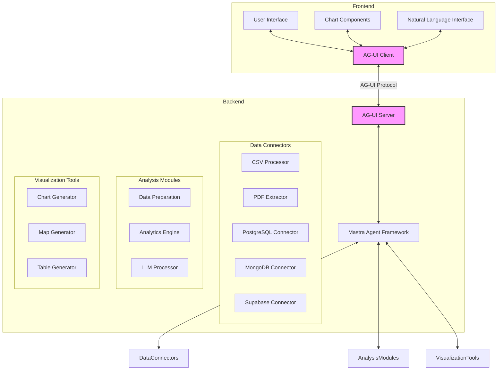
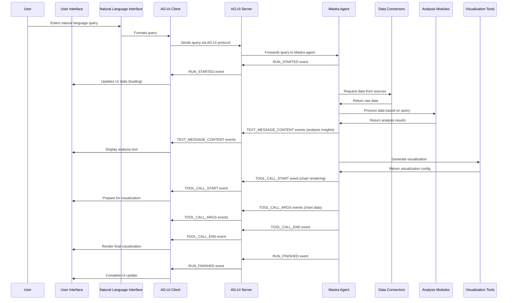
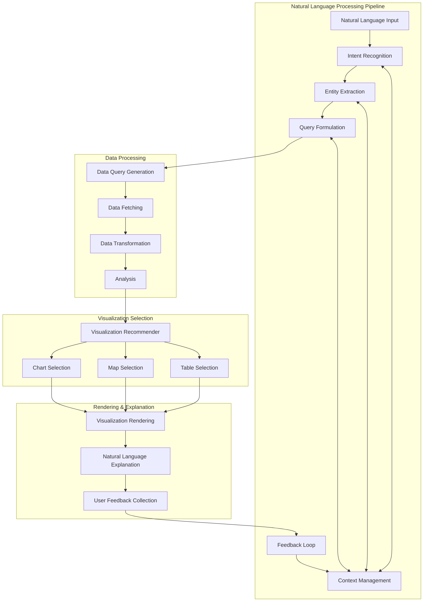
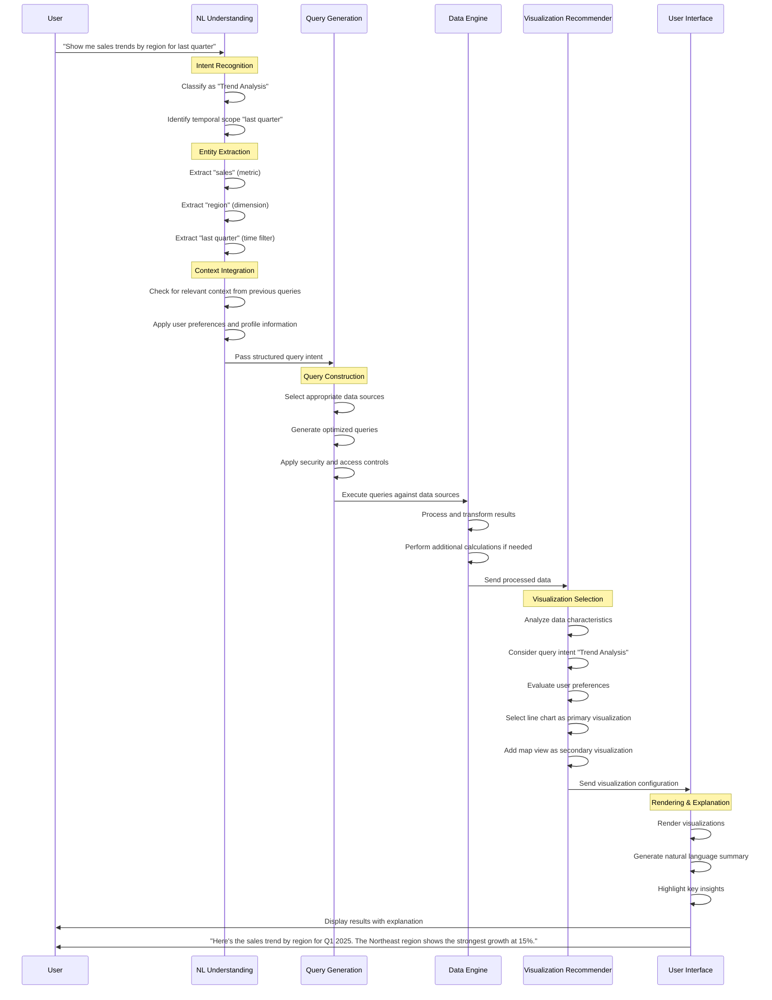

# AG-UI Business Intelligence Tool with Mastra

## Table of Contents
- [1. System Architecture](#1-system-architecture)
- [2. Component Breakdown](#2-component-breakdown)
  - [2.1 Frontend Components](#21-frontend-components)
  - [2.2 Backend Components](#22-backend-components)
- [3. Data Flow](#3-data-flow)
- [4. Implementation Phases](#4-implementation-phases)
- [5. Technical Details](#5-technical-details)
  - [5.1 AG-UI Integration](#51-ag-ui-integration)
  - [5.2 Mastra Agent Implementation](#52-mastra-agent-implementation)
  - [5.3 Natural Language Processing](#53-natural-language-processing)
  - [5.4 Visualization System](#54-visualization-system)
- [6. Security and Data Privacy](#6-security-and-data-privacy)
- [7. Extensibility](#7-extensibility)
- [8. Natural Language Interface](#8-natural-language-interface)
  - [8.1 Natural Language Understanding Architecture](#81-natural-language-understanding-architecture)
  - [8.2 Translation Process Flow](#82-translation-process-flow)
  - [8.3 LLM Integration for Natural Language Processing](#83-llm-integration-for-natural-language-processing)
  - [8.4 Visualization Selection and Rendering](#84-visualization-selection-and-rendering)
  - [8.5 Feedback Loop and Continuous Improvement](#85-feedback-loop-and-continuous-improvement)
- [9. Implementation Plan for Natural Language Interface](#9-implementation-plan-for-natural-language-interface)

## 1. System Architecture

## 2. Component Breakdown

### 2.1 Frontend Components

1. **User Interface**
   - Dashboard layout with responsive design
   - Data source connection panel
   - Query builder interface
   - Results display area
   - Settings and configuration panel

2. **Natural Language Interface**
   - Text input for natural language queries
   - Query suggestion system
   - Query history tracking
   - Context-aware query refinement

3. **Chart Components**
   - Standard charts (bar, line, pie, scatter)
   - Geographic maps with data overlays
   - Interactive data tables
   - Custom visualization options

4. **AG-UI Client**
   - Event handling for real-time updates
   - State management for UI synchronization
   - Tool call processing for visualization rendering
   - Error handling and recovery

### 2.2 Backend Components

1. **Mastra Agent Framework**
   - TypeScript-based agent implementation
   - Event emission compatible with AG-UI
   - Tool definition for data processing and visualization
   - State management for query context

2. **Data Connectors**
   - CSV file parser and processor
   - PDF text and table extractor
   - PostgreSQL connection and query manager
   - MongoDB connection and query manager
   - Supabase connection and query manager

3. **Analysis Modules**
   - Data preparation and cleaning
   - Statistical analysis functions
   - Natural language query parser
   - LLM integration for query understanding and data analysis

4. **Visualization Tools**
   - Chart generation tools
   - Geographic map rendering
   - Data table formatting
   - Visualization recommendation engine

5. **AG-UI Server**
   - Event processing and routing
   - Tool call handling
   - State synchronization
   - Error management

## 3. Data Flow

## 4. Implementation Phases

### Phase 1: Foundation Setup
1. Set up project structure and dependencies
2. Implement basic AG-UI client and server
3. Create Mastra agent skeleton
4. Develop core UI components
5. Implement basic natural language interface

### Phase 2: Data Connector Implementation
1. Develop CSV file processor
2. Implement PDF text and table extractor
3. Create PostgreSQL connector
4. Build MongoDB connector
5. Develop Supabase connector

### Phase 3: Analysis Engine Development
1. Implement data preparation and cleaning modules
2. Develop statistical analysis functions
3. Create natural language query parser
4. Integrate LLM for query understanding
5. Build analysis result formatter

### Phase 4: Visualization System
1. Implement standard chart generators
2. Develop geographic map rendering
3. Create interactive data table component
4. Build visualization recommendation engine
5. Implement tool calls for visualization rendering

### Phase 5: Integration and Refinement
1. Connect all components through AG-UI protocol
2. Implement state management and synchronization
3. Develop error handling and recovery mechanisms
4. Optimize performance and responsiveness
5. Refine user experience and interface

## 5. Technical Details

### 5.1 AG-UI Integration

The system will leverage AG-UI's event-based architecture to enable real-time communication between the frontend and backend:

1. **Event Types Used:**
   - Lifecycle events (RUN_STARTED, RUN_FINISHED) for query execution tracking
   - Text message events for streaming analysis results
   - Tool call events for rendering visualizations
   - State management events for synchronizing UI state

2. **Tool Call Implementation:**
   - Define tools for each visualization type
   - Stream visualization data through tool call arguments
   - Render visualizations based on tool call parameters

3. **State Management:**
   - Use STATE_SNAPSHOT for initial data loading
   - Implement STATE_DELTA for incremental updates to visualizations
   - Maintain query context and history through state events

### 5.2 Mastra Agent Implementation

The Mastra agent will be implemented as a TypeScript-based agent that:

1. Processes natural language queries
2. Coordinates data retrieval from various sources
3. Performs analysis using built-in functions and LLM capabilities
4. Generates visualizations based on data and query intent
5. Emits AG-UI compatible events for frontend communication

### 5.3 Natural Language Processing

The natural language interface will:

1. Parse user queries to extract intent and parameters
2. Translate natural language to structured data queries
3. Use LLM to understand context and generate appropriate analyses
4. Provide suggestions and refinements for user queries
5. Learn from user interactions to improve over time

### 5.4 Visualization System

The visualization system will:

1. Automatically recommend appropriate visualizations based on data
2. Support standard charts (bar, line, pie, scatter)
3. Implement geographic mapping with data overlays
4. Provide interactive data tables with sorting and filtering
5. Allow customization of visualization parameters

## 6. Security and Data Privacy

1. Implement secure authentication for database connections
2. Store connection credentials securely
3. Process data locally when possible to minimize data transmission
4. Implement data access controls and permissions
5. Ensure compliance with data privacy regulations

## 7. Extensibility

The system will be designed for extensibility:

1. Modular architecture for adding new data connectors
2. Plugin system for additional visualization types
3. Extensible analysis module for new analytical capabilities
4. Configurable LLM integration to support different providers
5. Customizable UI components for different use cases

## 8. Natural Language Interface

### 8.1 Natural Language Understanding Architecture

The natural language interface will be a core component of our BI tool, enabling non-technical users to interact with data through conversational queries. Here's the detailed architecture:

#### 8.1.1 Intent Recognition System

- **Query Classification Module**
  - Categorizes queries into types: descriptive, diagnostic, predictive, or prescriptive
  - Identifies primary analytical goals (comparison, trend analysis, correlation, etc.)
  - Uses a combination of rule-based patterns and ML classification

- **Domain-Specific Intent Recognition**
  - Specialized models for different business domains (finance, marketing, operations)
  - Recognition of industry-specific terminology and metrics
  - Contextual understanding of business KPIs

#### 8.1.2 Entity Extraction Engine

- **Data Source Identification**
  - Recognizes references to specific data sources (CSV files, databases, etc.)
  - Resolves ambiguous references through context or clarification
  - Maps natural language references to actual data source connections

- **Field and Metric Recognition**
  - Extracts column names, metrics, and dimensions from natural language
  - Handles synonyms and alternative expressions for the same data elements
  - Maintains a dynamic dictionary of data elements across connected sources

- **Filter and Condition Parsing**
  - Identifies temporal references ("last quarter", "year-to-date")
  - Extracts comparison operators and values ("greater than 100", "top 5")
  - Understands logical connectors ("and", "or", "except")

#### 8.1.3 Query Formulation System

- **Query Template Engine**
  - Converts recognized intents and entities into parameterized query templates
  - Supports multiple query languages (SQL, MongoDB queries, etc.)
  - Handles complex query patterns like joins, aggregations, and subqueries

- **Query Optimization Layer**
  - Analyzes generated queries for performance issues
  - Applies database-specific optimizations
  - Manages query complexity for responsive performance

- **Multi-Source Query Coordinator**
  - Orchestrates queries across different data sources
  - Handles data integration from heterogeneous sources
  - Manages query execution order and data merging

#### 8.1.4 Context Management System

- **Conversation History Tracker**
  - Maintains the history of user queries and system responses
  - Enables follow-up questions with pronouns ("Show me that by region")
  - Supports query refinement based on previous interactions

- **User Profile Manager**
  - Stores user preferences and frequently accessed data
  - Personalizes responses based on user role and interests
  - Adapts to individual user's analytical patterns

- **Session State Manager**
  - Maintains the current analytical context
  - Tracks active filters and selections across visualizations
  - Enables contextual operations like drilling down or filtering

### 8.2 Translation Process Flow

The process of translating natural language to data queries and visualizations follows these steps:

### 8.3 LLM Integration for Natural Language Processing

The natural language interface will leverage LLMs through the following integration points:

#### 8.3.1 Query Understanding and Disambiguation

- **Intent Classification**
  - LLM analyzes the query to determine the analytical intent
  - Handles complex, multi-part questions
  - Identifies implicit requirements not directly stated

- **Semantic Parsing**
  - Extracts structured information from unstructured text
  - Resolves ambiguous terms based on context
  - Handles domain-specific jargon and terminology

- **Query Refinement**
  - Suggests improvements to ambiguous queries
  - Asks clarifying questions when needed
  - Provides alternative interpretations for validation

#### 8.3.2 Data-Aware Query Processing

- **Schema Understanding**
  - LLM is fine-tuned with metadata from connected data sources
  - Maps natural language terms to actual database fields
  - Understands relationships between tables and collections

- **Data-Driven Suggestions**
  - Recommends relevant metrics based on query context
  - Suggests filters based on data distribution
  - Identifies potential data quality issues

- **Query Translation**
  - Converts natural language to structured query language
  - Handles complex analytical requirements
  - Optimizes queries for specific database engines

#### 8.3.3 Insight Generation and Explanation

- **Automated Analysis**
  - Identifies patterns, trends, and anomalies in query results
  - Performs statistical analysis to validate observations
  - Generates hypotheses about causal relationships

- **Natural Language Summaries**
  - Creates concise descriptions of visualization content
  - Highlights key insights and important data points
  - Adapts explanation detail based on user expertise

- **Contextual Recommendations**
  - Suggests follow-up questions based on current results
  - Recommends related analyses for deeper understanding
  - Proposes alternative visualizations for different perspectives

### 8.4 Visualization Selection and Rendering

The system will intelligently select and render visualizations based on:

#### 8.4.1 Data-Driven Visualization Selection

- **Data Characteristic Analysis**
  - Analyzes data type, cardinality, and distribution
  - Considers relationships between variables
  - Evaluates data volume and density

- **Query Intent Matching**
  - Maps analytical intents to visualization types
  - Comparison → Bar charts, tables
  - Trends → Line charts, area charts
  - Relationships → Scatter plots, network diagrams
  - Composition → Pie charts, treemaps
  - Geospatial → Maps, choropleth diagrams

- **Multi-Visualization Approach**
  - Presents primary visualization based on main intent
  - Offers complementary visualizations for additional perspectives
  - Enables easy switching between visualization types

#### 8.4.2 Adaptive Visualization Rendering

- **Responsive Design**
  - Adapts visualizations to device and screen size
  - Optimizes information density based on display constraints
  - Maintains readability and interaction capabilities

- **Progressive Disclosure**
  - Initially shows simplified visualization with key insights
  - Provides drill-down capabilities for detailed exploration
  - Balances information completeness with cognitive load

- **Accessibility Considerations**
  - Ensures color schemes work for color-blind users
  - Provides alternative text descriptions for screen readers
  - Supports keyboard navigation for all interactions

### 8.5 Feedback Loop and Continuous Improvement

The natural language interface will improve over time through:

#### 8.5.1 User Feedback Collection

- **Explicit Feedback**
  - Ratings for query understanding accuracy
  - Feedback on visualization appropriateness
  - Suggestions for alternative interpretations

- **Implicit Feedback**
  - Tracking visualization interactions
  - Monitoring query refinements and modifications
  - Observing session duration and engagement patterns

#### 8.5.2 Learning and Adaptation

- **Query Understanding Improvement**
  - Updates intent recognition models based on feedback
  - Expands entity recognition dictionaries
  - Refines disambiguation strategies

- **Personalization**
  - Adapts to individual user's terminology and preferences
  - Learns common analytical patterns by user or role
  - Customizes visualization defaults based on usage

- **Knowledge Base Expansion**
  - Continuously updates domain-specific knowledge
  - Incorporates new data sources and schemas
  - Expands understanding of business metrics and KPIs

## 9. Implementation Plan for Natural Language Interface

### Phase 1: Foundation (Weeks 1-3)
1. Set up basic NLP pipeline architecture
2. Implement intent classification for common query types
3. Develop entity extraction for basic data elements
4. Create simple query generation for single data sources
5. Build basic visualization recommendation system

### Phase 2: Core Functionality (Weeks 4-6)
1. Integrate LLM for query understanding and disambiguation
2. Implement schema-aware query translation
3. Develop multi-source query coordination
4. Create context management system for conversation history
5. Build visualization selection based on query intent

### Phase 3: Advanced Features (Weeks 7-9)
1. Implement natural language explanation generation
2. Develop feedback collection mechanisms
3. Create personalization system based on user profiles
4. Build advanced entity resolution for complex queries
5. Implement query optimization for performance

### Phase 4: Refinement and Integration (Weeks 10-12)
1. Integrate with all data connectors
2. Implement comprehensive visualization options
3. Develop adaptive learning from user feedback
4. Create domain-specific enhancements for common industries
5. Build comprehensive testing and validation system