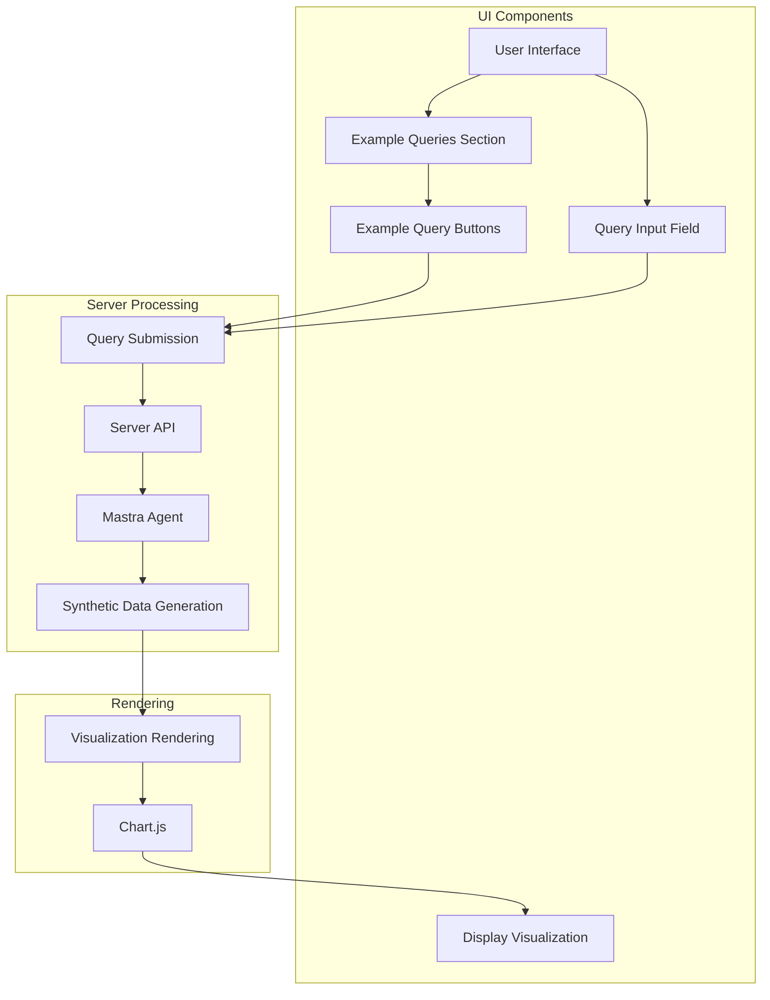

# Example Query Feature Implementation Plan

## Overview

The goal is to create a system where example queries from the example-queries.md file are displayed as clickable buttons, organized by category (bar charts, line charts, etc.), displayed above the input field. When clicked, these queries should automatically submit and generate the corresponding visualization.

## Current System Analysis

The current system:
- Has a text input field where users manually type queries
- Processes queries through the Mastra agent which generates synthetic data
- Renders visualizations (charts, tables, maps) based on the query response
- Has a renderChart function that currently only renders bar charts
- Contains example queries in a markdown file but doesn't expose them in the UI

## Implementation Plan

### 1. Create Example Query UI Component

We'll add a new section above the query input field to display example queries organized by categories:

```html
<div class="example-queries-section">
  <h3>Example Queries</h3>
  <div class="query-categories">
    <!-- Categories will be dynamically generated here -->
  </div>
</div>
```

This section will be added to the index.html file, just above the existing query-section div:

```html
<div class="container">
  <div class="example-queries-section">
    <h3>Example Queries</h3>
    <div class="query-categories">
      <!-- Categories will be dynamically generated here -->
    </div>
  </div>
  
  <div class="query-section">
    <h2>Ask a Question</h2>
    <input type="text" id="query-input" class="query-input" placeholder="e.g., Show me a bar chart of sales by region">
    <button id="query-button" class="query-button">Submit Query</button>
  </div>
  
  <div class="results-section" id="results">
    <p>Enter a query above to get started.</p>
  </div>
</div>
```

### 2. Extract and Process Example Queries

We'll create a JavaScript function to extract and organize the example queries from the example-queries.md file. Since we can't directly read the markdown file from the client-side JavaScript, we'll hardcode the example queries in a data structure:

```javascript
// Example query data structure
const exampleQueries = {
  'Bar Charts': [
    { text: 'Show me a bar chart of sales by region', description: 'Generates a bar chart showing sales data across different regions' },
    { text: 'Create a bar chart comparing revenue by product category', description: 'Generates a bar chart comparing revenue across product categories' },
    { text: 'Display monthly sales for Q1 as a bar chart', description: 'Generates a bar chart showing sales for January, February, and March' }
  ],
  'Line Charts': [
    { text: 'Show me a line chart of website traffic over the past week', description: 'Generates a line chart showing daily website traffic' },
    { text: 'Create a line chart of customer growth over the past year', description: 'Generates a line chart showing customer acquisition over time' },
    { text: 'Display a line chart of stock price trends', description: 'Generates a line chart showing stock price movements' }
  ],
  'Pie Charts': [
    { text: 'Show me a pie chart of market share by company', description: 'Generates a pie chart showing market share distribution' },
    { text: 'Create a pie chart of budget allocation by department', description: 'Generates a pie chart showing budget distribution across departments' },
    { text: 'Display a pie chart of sales by product category', description: 'Generates a pie chart showing sales distribution across product categories' }
  ],
  'Tables': [
    { text: 'Show me a table of top 10 customers by revenue', description: 'Generates a table listing customers and their revenue contributions' },
    { text: 'Create a table of inventory levels by product', description: 'Generates a table showing products and their current inventory levels' },
    { text: 'Display a table of employee performance metrics', description: 'Generates a table showing employee performance data' }
  ],
  'Maps': [
    { text: 'Show me a map of store locations', description: 'Generates a map visualization showing store locations' },
    { text: 'Create a map of customer density by region', description: 'Generates a map showing customer density across regions' },
    { text: 'Display a map of sales performance by territory', description: 'Generates a map showing sales performance across territories' }
  ]
};
```

### 3. Render Example Query Buttons

We'll create a function to render the example queries as clickable buttons:

```javascript
function renderExampleQueries(exampleQueries) {
  const categoriesContainer = document.querySelector('.query-categories');
  
  for (const [category, queries] of Object.entries(exampleQueries)) {
    // Create category section
    const categorySection = document.createElement('div');
    categorySection.className = 'query-category';
    
    // Add category title
    const categoryTitle = document.createElement('h4');
    categoryTitle.textContent = category;
    categorySection.appendChild(categoryTitle);
    
    // Add query buttons
    const queryButtons = document.createElement('div');
    queryButtons.className = 'query-buttons';
    
    queries.forEach(query => {
      const button = document.createElement('button');
      button.className = 'example-query-button';
      button.textContent = query.text;
      button.title = query.description;
      button.addEventListener('click', () => submitExampleQuery(query.text));
      queryButtons.appendChild(button);
    });
    
    categorySection.appendChild(queryButtons);
    categoriesContainer.appendChild(categorySection);
  }
}
```

### 4. Handle Example Query Submission

We'll create a function to handle clicking on an example query:

```javascript
function submitExampleQuery(queryText) {
  // Set the query input value
  document.getElementById('query-input').value = queryText;
  
  // Trigger the query submission
  document.getElementById('query-button').click();
}
```

### 5. Update Chart Rendering

We'll update the renderChart function to handle different chart types:

```javascript
function renderChart(container, data) {
  // Create canvas for Chart.js
  const canvas = document.createElement('canvas');
  container.appendChild(canvas);

  // Destroy previous chart if it exists
  if (chartInstance) {
    chartInstance.destroy();
  }

  // Extract data for Chart.js
  const labels = data.data.map(item => item.category);
  const values = data.data.map(item => item.value);

  // Determine chart type (default to bar if not specified)
  const chartType = data.chartType || 'bar';

  // Configure chart options based on chart type
  let chartOptions = {
    responsive: true,
    maintainAspectRatio: false,
    scales: {
      y: {
        beginAtZero: true
      }
    }
  };

  // For pie charts, we don't need scales
  if (chartType === 'pie') {
    delete chartOptions.scales;
  }

  // Create chart
  chartInstance = new Chart(canvas, {
    type: chartType, // Use the chart type from the data
    data: {
      labels: labels,
      datasets: [{
        label: data.options.title || 'Data',
        data: values,
        backgroundColor: [
          'rgba(54, 162, 235, 0.5)',
          'rgba(255, 99, 132, 0.5)',
          'rgba(255, 206, 86, 0.5)',
          'rgba(75, 192, 192, 0.5)',
          'rgba(153, 102, 255, 0.5)',
        ],
        borderColor: [
          'rgba(54, 162, 235, 1)',
          'rgba(255, 99, 132, 1)',
          'rgba(255, 206, 86, 1)',
          'rgba(75, 192, 192, 1)',
          'rgba(153, 102, 255, 1)',
        ],
        borderWidth: 1
      }]
    },
    options: chartOptions
  });
}
```

### 6. Add CSS Styling

We'll add CSS styling for the example query buttons:

```css
.example-queries-section {
  margin-bottom: 20px;
  background-color: white;
  padding: 20px;
  border-radius: 5px;
  box-shadow: 0 2px 5px rgba(0, 0, 0, 0.1);
}

.example-queries-section h3 {
  margin-top: 0;
  margin-bottom: 15px;
  color: #333;
}

.query-category {
  margin-bottom: 15px;
}

.query-category h4 {
  margin-bottom: 10px;
  color: #333;
  border-bottom: 1px solid #eee;
  padding-bottom: 5px;
}

.query-buttons {
  display: flex;
  flex-wrap: wrap;
  gap: 10px;
}

.example-query-button {
  background-color: #f1f9ff;
  border: 1px solid #3498db;
  border-radius: 4px;
  padding: 8px 12px;
  font-size: 14px;
  cursor: pointer;
  transition: background-color 0.2s;
}

.example-query-button:hover {
  background-color: #d4e9f7;
}
```

### 7. Initialize Example Queries on Page Load

We'll add code to initialize the example queries when the page loads:

```javascript
document.addEventListener('DOMContentLoaded', () => {
  // Initialize example queries
  renderExampleQueries(exampleQueries);
  
  // Existing code for query input and button...
});
```

## Architecture Diagram



## Data Flow

1. On page load, the example queries are extracted and organized by category
2. The example query buttons are rendered in the UI, grouped by category
3. When a user clicks on an example query button:
   - The query text is set in the input field
   - The query submission is triggered automatically
4. The query is sent to the server API
5. The Mastra agent processes the query and generates synthetic data
6. The synthetic data is returned to the client
7. The appropriate visualization is rendered based on the data type
8. The visualization is displayed to the user

## Implementation Steps

1. **Update HTML Structure**:
   - Add the example queries section above the query input field

2. **Add JavaScript Functions**:
   - Create the example queries data structure
   - Implement the renderExampleQueries function
   - Implement the submitExampleQuery function
   - Update the renderChart function to handle different chart types

3. **Add CSS Styling**:
   - Style the example queries section and buttons

4. **Test the Implementation**:
   - Verify that all example queries are displayed correctly
   - Test clicking on example queries to ensure they submit correctly
   - Verify that different chart types (bar, line, pie) render correctly

## Code Changes Summary

1. **HTML Changes**:
   - Add a new div with class "example-queries-section" above the query-section div

2. **JavaScript Changes**:
   - Add the exampleQueries data structure
   - Add the renderExampleQueries function
   - Add the submitExampleQuery function
   - Update the renderChart function to handle different chart types
   - Add initialization code to the DOMContentLoaded event listener

3. **CSS Changes**:
   - Add styling for the example queries section, categories, and buttons